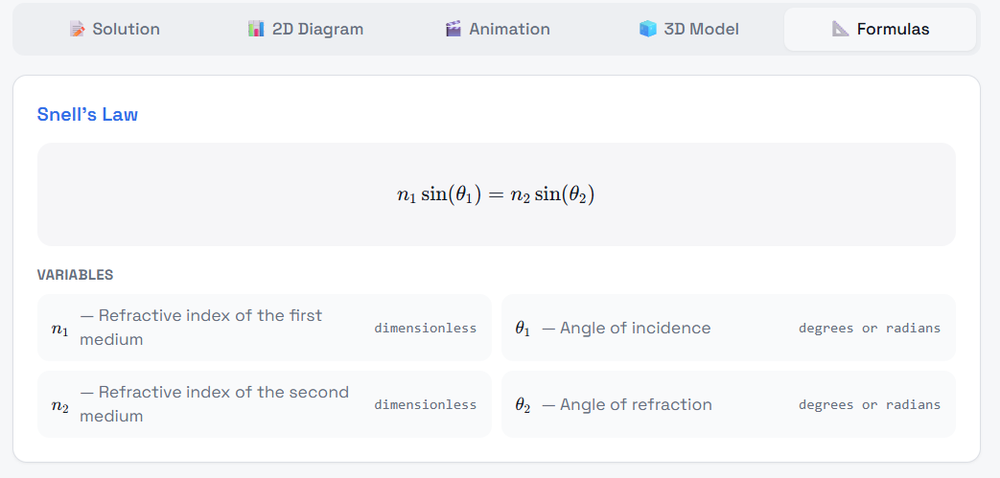
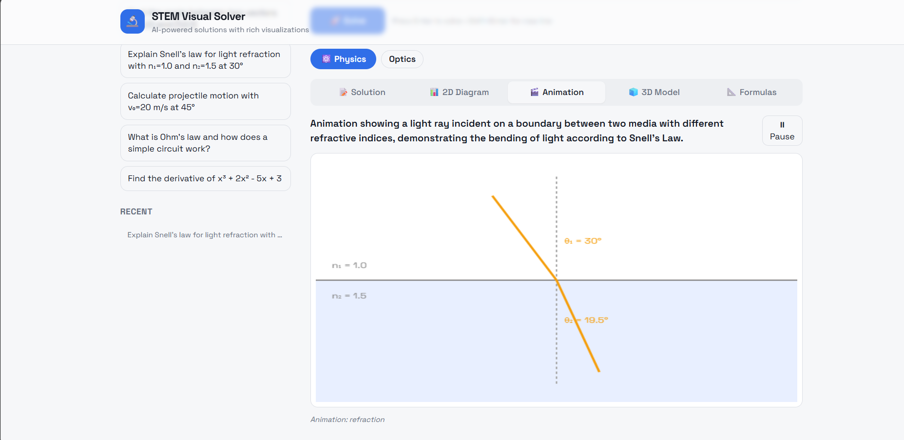
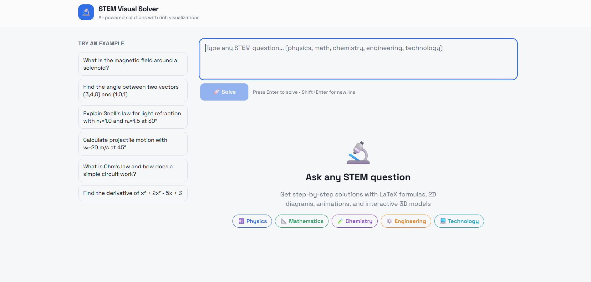

# Vision Crew – STEM Visual Learning Platform

## 📖 Project Description

Vision Crew is an interactive STEM visualization platform designed to help students understand complex science, technology, engineering, and mathematics concepts through Visual simulations instead of traditional text-based learning.

The platform focuses on improving conceptual clarity using dynamic visual representations.

## 🚀 Features

- Visual representation of STEM concepts
- Interactive simulations
- Easy-to-understand UI
- Fast rendering of scientific models
- Supports multiple STEM domains

## 🛠️ Tech Stack

Frontend:
- React.js
- Tailwind CSS

Backend:
- Python
- Streamlit / Flask

Libraries:
- Three.js
- NumPy
- Matplotlib

## ⚙️ How to Run the Project

### Step 1: Clone Repository
git clone https://github.com/anugnapatha2007/vision-crew

### Step 2: Navigate to Folder
cd curious-canvas-app-main
npm install
npm run dev

### Step 3: Install Dependencies
pip install -r requirements.txt

you will see local and network 
you can open any of the links

## 📦 Dependencies

- Python 3.9+
- Streamlit
- NumPy
- Matplotlib
- Three.js

## 🖼️ Demo Screenshots

## 📂 Directory Structure

project-name/
│── src/
│── assets/
│── docs/
│── README.md

## 👨‍💻 Contributors

-P.Anugna
-K.Pavani
-S.Varnika
-M.Hani lasya